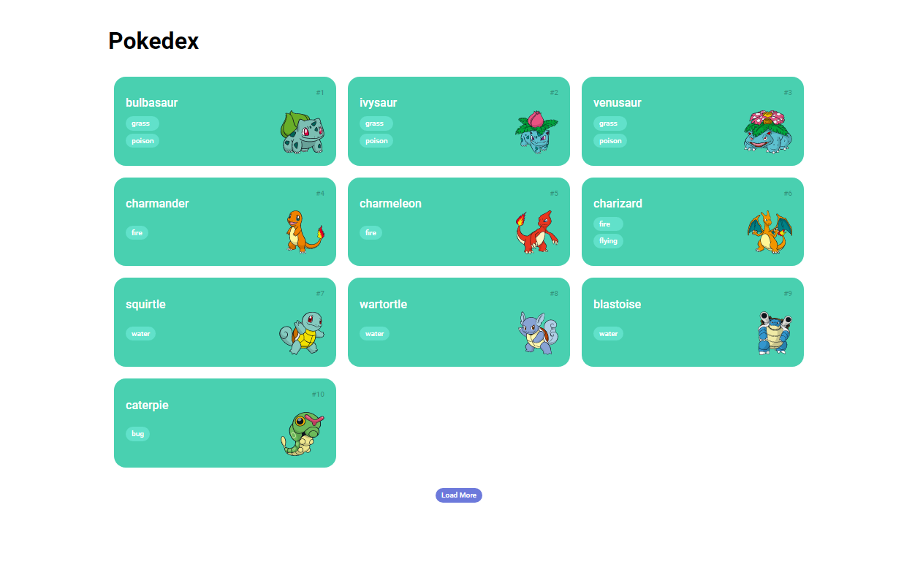

<h1 align="center"> Pokedex </h1>

A pokedex é um site que vem com o intuito de agrupar todas as espécies de pokémos, se tornando basicamente como uma enciclopédia virtual!  

  <a href="#-tecnologias">Tecnologias</a>&nbsp;&nbsp;&nbsp;|&nbsp;&nbsp;&nbsp;
  <a href="#-projeto">Projeto</a>&nbsp;&nbsp;&nbsp;|&nbsp;&nbsp;&nbsp;
 

  

 

  

## 🚀 Tecnologias

Esse projeto foi desenvolvido com as seguintes tecnologias:

- HTML e CSS
- JavaScript
- Git e Github

## 💻 Projeto

A Pokedex é uma enciclopédia virtual que agrupa todas as espécies de pokémos.

- [Visite o projeto online](https://github.com/lorenaop/pokedex.git)

